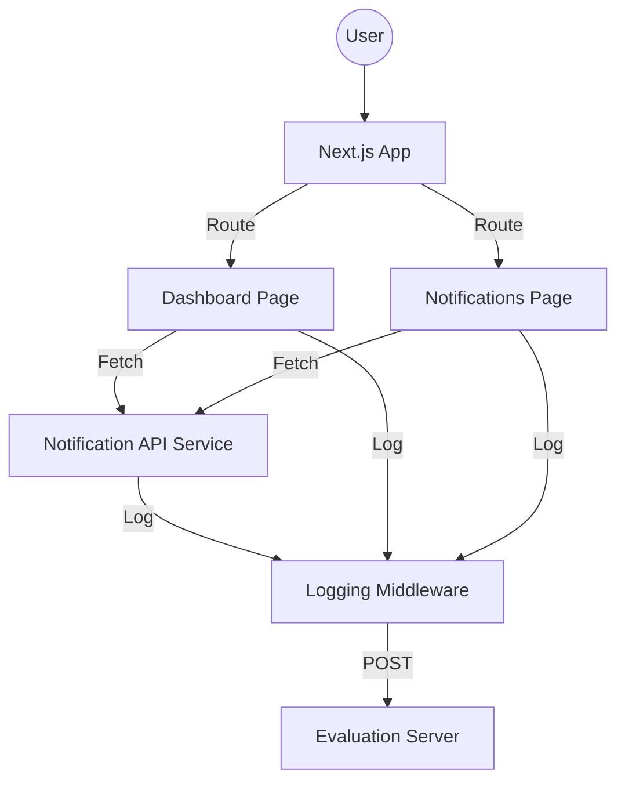

# Notification System Design

## Overview
This project implements a campus notification system with a shared logging middleware. The system is built in stages, focusing on backend processing (Stage 1) and a robust React/Next.js frontend (Stage 2).

## Architecture

### Frontend (Stage 2 - Next.js)
The frontend is built with Next.js and Material UI, following a modular structure:

- **Components**: Reusable UI elements (NotificationCard, FilterBar, etc.).
- **Pages**: Top-level views (Dashboard, Notifications List).
- **Services**: API communication logic with integrated logging.
- **Hooks**: Custom logic for state management (e.g., viewed status tracking).
- **Utils**: Shared helpers (priority sorting, formatting).

## UI/UX Decisions

1.  **Material UI**: Used exclusively for consistent, responsive design.
2.  **Dashboard**: Focuses on high-priority alerts (Placement > Result > Event) to reduce cognitive load.
3.  **Viewed Tracking**: Notifications are marked as viewed when clicked. Viewed states are stored in `localStorage` for persistence without a database.
4.  **Visual Cues**: 
    - **Unread**: Bold text and blue left border.
    - **Read**: Subdued text and action-hover background.
5.  **Filtering & Pagination**: Allows users to manage large volumes of notifications efficiently.

## Logging Strategy (Frontend)

Every major user interaction and lifecycle event is logged:
- **Page Mounts**: Logs when a user enters a page.
- **API Events**: Logs before fetching and after success/failure (including counts).
- **User Actions**: Logs filter changes, page navigation, and marking items as viewed.
- **State Updates**: Logs when local state is significantly modified.

## Data Flow (Viewed Tracking)
1. User clicks `NotificationCard`.
2. `markAsViewed(id)` is called.
3. ID is added to `viewedIds` state and `localStorage`.
4. Log is sent to middleware.
5. Card re-renders with subdued styling.
